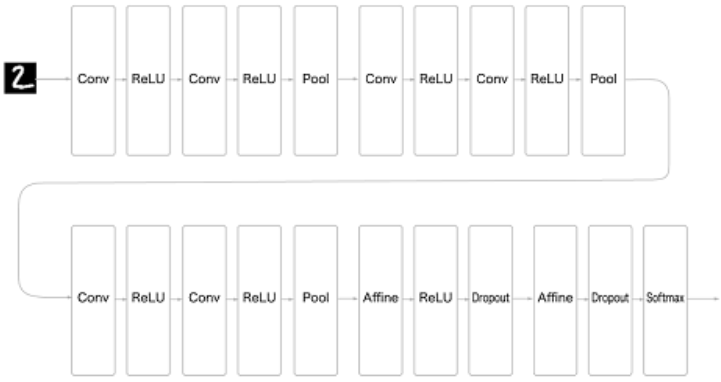

# 8. 딥러닝

- 딥러닝의 특징과 과제, 그리고 가능성을 살펴보자.

## 8.1 더 깊게

### 8.1.1 더 깊게

- 이전 장과 다르게, 더 복잡한 네트워크를 구성해보자.

    

    - 3x3의 작은 필터를 사용한 합성곱 계층
    - ReLU 활성화 함수 사용
    - 완결연결 계층 뒤에 드롭아웃 계층 사용
    - Adam을 사용해 최적화
    - He 가중치 초깃값
- 이처럼 복잡한 모델을 사용하여 MNIST문제를 풀면, 정확도가 99.38%까지 올라간다.
- 그럼 왜 깊게 층을 파면 성능이 올라가고, 어떻게 하면 정확도를 더 올릴 수 있을까?

### 8.1.2 정확도를 더 높이려면

- 다른 연구들을 찾아보면 알아볼 수 있지만, 대표적으론
    - 앙상블 방법
    - 학습률 감소
    - 데이터 확장 등을 통해 정확도를 올릴 수 있다.
- 특히 **데이터 확장(data augmentation)**은,
    - 데이터를 인위적으로 변형시킨다.
    - 회전이나 이동, 크롭, 좌우변형(flip) 등의 기법이 있다.
    - 또한 밝기 변형, 확대, 축소 등도 적용시켜 성능을 올릴 수 있다.

### 8.1.3 깊게 하는 이유

- 깊지 않은 경우에 비해 더 **적은 매개변수**로 더 좋은 표현력을 달성할 수 있다.

    

    - 예를들어, 5*5의 합성곱 연산 1회는 3*3 합성곱 2회로 대체할 수 있다.
        - 전자는 25개의 매개변수(5*5), 후자는 18개의 매개변수(2*3*3)가 필요하다.
        - 이 차이는 층이 깊어질수록 커진다.
        - 매개변수의 수를 줄이면서 수용 영역(receptive field)를 소화할 수 있다.
        - 또한 층을 거듭하며 ReLU와 같은 활성화함수가 끼워지며 신경망의 표현력도 개선된다.
- **학습의 효율성**이 증대된다.
    - 학습 데이터의 양을 줄여 빠른 속도로 학습시킬 수 있다.
    - 직관적으로 이야기하면, 앞장에서 첫 층에선 에지, 블롭 등의 정보를 추출하지만,
    - 층이 깊어지면 텍스처, 사물 등의 고급 정보를 추출하게 된다고 배웠다.
        - 근데 층이 깊지 않으면 (2층이라고 가정하면) 첫 층에서 에지, 블롭등을 전달하고
        - 두 번째 층에서 더 복잡한 패턴을 발견해내야한다.
        - 하지만 층이 깊다면,
            - 여러 층에 거쳐 단순화된 특징들이 풍부한 표현력을 갖게 된다.
    - 즉... 문제를 체계적으로 분해하여 이해하게된다.
- 이렇게 층을 깊게 파서 문제를 해결할 수 있게 된 배경에는 빅데이터와 컴퓨터 연산 능력의 발전에 있다.

## 8.2 딥러닝의 초기 역사

- 이미지 인식 기술 대회인 ILSVRC(ImageNet Large Scale Visual Recognition Challenge)의 2012년 대회다.
    - 이 대회에서 AlexNet이 압도적 성적으로 우승하며 딥러닝이 주목을 받게 되었다.
    - 최근의 딥러닝 트렌드를 살펴보자.

### 8.2.1 이미지넷

- 이미지넷은 100만장 이상의 이미지를 담은 데이터셋이다.
- 매년 열리는 대회인데, 이 중 분류 부문이 있다.
    - 1,000개의 클래스를 분류하는 문제인데 2012년 AlexNet이 오류율을 크게 낮추었고,
    - 그 이후 VGG, GoogLeNet, ResNet 등이 정확도를 크게 개선시켰다.

### 8.2.2 VGG

- 합성곱 계층과 풀링 계층으로 구성되어있다.
    - 합성곱 계층, 완전연결 계층을 모두 16층 혹은 19층으로 심화한 것이 특징이다.
    - 3*3의 필터를 사용한 합성곱 계층을 연속으로 거치며,
    - 합성곱 계층을 2~4회 연속으로 풀링 계층을 두어 크기를 절반으로 줄여나간다.
- 다른 신경망에 비해서 성능이 약간 떨어지지만, 구성이 간단하여 응용하기 좋다.

### 8.2.3 GoogLeNet

- 가로 방향으로도 깊고, 세로 방향으로도 깊은 것이 특징이다.
- 가로 방향에 '폭'이 있는데, 이를 인셉션 구조라고 한다.

    

    - 인셉션 구조란, 크기가 다른 필터를 여럿 적용하여 이를 결합하는 것이다.
    - 이 인셉션 구조를 하나의 구성요소로 사용한다.
    - GoogLeNet에선 그림에서 맨 오른쪽에 보이는 1*1 합성곱을 자주 사용하는데,
        - 채널 쪽으로 크기를 줄이는 것으로, 매개변수 제거와 고속 처리에 기여한다고 한다.
        - [자세한건 논문에서..](https://arxiv.org/pdf/1409.4842.pdf)

### 8.2.4 ResNet

- 딥러닝의 층을 깊게 쌓으면 장점이 많지만,
    - 학습이 잘 되지 않거나
    - 기울기 소실 문제 등이 발생할 수 있다.
- 이런 문제점을 해결한 것이 ResNet이다.
    - 스킵 연결(Skip connection)을 도입하여 층의 깊이에 비례하여 성능을 향상시킬 수 있게 하였다.
- 스킵 연결을 간단히 정리하면,
    - 계층 - 활성화함수를 거쳐 나온 출력값에
    - 입력 데이터를 바로 더하는 구조다.
    - 수식으로 표현하면..

        

        - 계층을 거친 출력값이 $F(x)$라면,
        - 그 출력값에 입력값을 더하여 $F(x) + x$로 만든다. (초기 입력값만 의미하는게 아님)
    - 스킵 연결은 층이 깊어져도 기울기 소실 문제를 줄여주며, 학습을 효율적으로 할 수 있게 해준다. (역전파 때 신호 감쇠를 막아줌)

    

    - ResNet은 합성곱 계층을 2층마다 건너뛰며 층을 깊게 하며, 이를 통해 층이 깊어도 정확도가 올라간다.

> 이미지넷의 데이터로 학습한 가중치 값들은 다른 문제에 쓰여도 효과적인데, 이렇게 이미 학습된 신경망으로 재학습하는 것을 전이학습(transfer learning)이라고 한다. 보유한 데이터셋이 적을 때 특히 유용한 방법이다.

## 8.3 더 빠르게(딥러닝 고속화)

- 과거엔 CPU만 사용했지만, 최근엔 GPU를 활용해 대량의 연산을 고속으로 처리한다.
- 그리고 복수의 GPU를 사용해서 딥러닝을 고속화시키고있다.

### 8.3.1 풀어야할 숙제

- 딥러닝에서 가장 오래 걸리는 계산은 합성곱 계층이다.
    - 합성곱 연산은 결국 단일 곱셈 - 합계 하는 연산이므로, 이를 어떻게 고속화하는가가 가장 큰 문제이다.

### 8.3.2 GPU를 활용한 고속화

- GPU의 고속 병렬 수치 연산을 활용하는 것이 GPU컴퓨팅의 목적이다.
    - CPU는 연속적인 복잡한 계산을 잘 처리한다.
- AMD보다는 상대적으로 엔비디아가 더 딥러닝-친화적이다.

### 8.3.3 분산 학습

- 딥러닝을 고속하기 위해 다수의 기기와 GPU로 분산한다.

### 8.3.4 연산 정밀도와 비트 줄이기

- 대량의 가중치들로 인해 메모리에 저장할 데이터가 많아진다.
- 또한 흐르는 데이터가 많아져 병목현상이 일어난다.
- 이를 해결하기 위해 오가는 데이터의 비트수를 최소한으로 줄이는 것이 좋다.
    - 딥러닝은 높은 비트의 정밀도를 요구하지 않는다.

---

## 요약

- 신경망을 깊게하면 복잡한 문제를 풀어낼 수 있다.
    - 그리고 깊게 하면 매개변수의 양을 줄일 수 있고, 더 효과적으로 이미지가 가진 의미를 파악할 수 있다.
- 유명한 신경망으론 VGG, GoogLeNet, ResNet이 있다.
- GPU, 분산 학습, 비트 정밀도 감소 등으로 딥러닝을 고속화할 수 있다.
